# 🔍 Fake News Detection — Pipeline NLP Complet

[](https://python.org)
[](https://pytorch.org)
[](https://huggingface.co)
[](https://scikit-learn.org)
[](https://colab.research.google.com)

> Projet NLP complet de détection de Fake News sur **57 689 articles**, combinant des approches **Machine Learning classique** et **Deep Learning** (LSTM + DistilBERT Fine-Tuned). Réalisé dans le cadre d'un mini-projet universitaire.

---

## 📋 Table des Matières

- [Objectif](#-objectif)
- [Datasets](#-datasets)
- [Architecture du Pipeline](#-architecture-du-pipeline)
- [Exploration des Données](#-exploration-des-données)
- [Prétraitement](#-prétraitement-du-texte)
- [Machine Learning Classique](#-machine-learning-classique)
- [Deep Learning — LSTM](#-deep-learning--lstm)
- [Deep Learning — DistilBERT](#-deep-learning--distilbert-fine-tuned)
- [Comparaison Finale](#-comparaison-finale--temps-vs-accuracy)
- [Résultats](#-résultats-globaux)
- [Installation](#-installation)
- [Structure du Projet](#-structure-du-projet)
- [Limitations](#-limitations)

---

## 🎯 Objectif

Construire un pipeline exhaustif de détection de Fake News en testant **toutes les combinaisons possibles** de :

| Composant | Options |
|-----------|---------|
| Représentation | BoW, TF-IDF, Word Embeddings, DistilBERT |
| Feature Selection | Chi-square, Mutual Information, Fisher Score |
| Top-K features | 20, 40, 100, 200, 400, 600, 1000, 1500 |
| Modèles ML | Logistic Regression, Random Forest, LinearSVC |
| Modèles DL | LSTM (BiLSTM + Global Avg Pooling), DistilBERT Fine-Tuned |

**Total : 144 combinaisons ML + 2 modèles DL testés et comparés.**

---

## 📦 Datasets

Le projet fusionne **deux datasets complémentaires** :

### 1. Fake and Real News Dataset
- Source : [Kaggle](https://www.kaggle.com/clmentbisaillon/fake-and-real-news-dataset)
- Contenu : Articles journalistiques complets
- `Fake.csv` : 23 481 articles fake
- `True.csv` : 21 417 articles réels
- **Total : 44 898 articles**

### 2. LIAR Dataset
- Source : [William Yang Wang, ACL 2017](https://www.cs.ucsb.edu/~william/data/liar_dataset.zip)
- Contenu : Déclarations politiques annotées
- Fichiers : `train.tsv`, `valid.tsv`, `test.tsv`
- Labels convertis en binaire : `pants-fire / false / barely-true` → **Fake (1)**, autres → **Real (0)**
- **Total : 12 791 déclarations**

### Dataset Final Fusionné
```
Total : 57 689 articles
  ├── Real (0) : 27 528 articles (47.7%)
  └── Fake (1) : 30 161 articles (52.3%)
```

---

## 🏗️ Architecture du Pipeline

```
┌─────────────────────────────────────────────────────────────────┐
│                     DONNÉES BRUTES                              │
│        Fake/Real News (44 898) + LIAR (12 791)                  │
└────────────────────────┬────────────────────────────────────────┘
                         │
                         ▼
┌─────────────────────────────────────────────────────────────────┐
│                   PRÉTRAITEMENT                                  │
│  Lowercase → Suppression URLs → Ponctuation → Stop Words        │
└────────────┬────────────────────────────────┬───────────────────┘
             │                                │
             ▼                                ▼
┌────────────────────────┐      ┌─────────────────────────────────┐
│   REPRÉSENTATIONS ML   │      │     REPRÉSENTATIONS DL          │
│  BoW (5000 features)   │      │  Word Embeddings (vocab=10k)    │
│  TF-IDF (5000 features)│      │  DistilBERT Tokenizer (128 tok) │
└────────────┬───────────┘      └──────────────┬──────────────────┘
             │                                 │
             ▼                                 ▼
┌────────────────────────┐      ┌─────────────────────────────────┐
│   FEATURE SELECTION    │      │        MODÈLES DL               │
│  Chi-square            │      │  BiLSTM + Dropout(0.4)          │
│  Mutual Information    │      │  + Global Average Pooling       │
│  Fisher Score          │      │  + Early Stopping (patience=3)  │
│  Top-K : 20→1500       │      │                                 │
└────────────┬───────────┘      │  DistilBERT Fine-Tuned          │
             │                  │  (3 epochs, AdamW, lr=2e-5)     │
             ▼                  └──────────────┬──────────────────┘
┌────────────────────────┐                     │
│     MODÈLES ML         │                     │
│  Logistic Regression   │                     │
│  Random Forest         │◄────────────────────┘
│  LinearSVC (Calibré)   │
└────────────┬───────────┘
             │
             ▼
┌─────────────────────────────────────────────────────────────────┐
│                    ÉVALUATION COMPLÈTE                          │
│  Accuracy | Precision | Recall | F1 | AUC | Log-Loss | Temps   │
│  Classification Report | Confusion Matrix | ROC Curve          │
└─────────────────────────────────────────────────────────────────┘
```

---

## 📊 Exploration des Données

### Distribution des Classes & Longueur des Textes

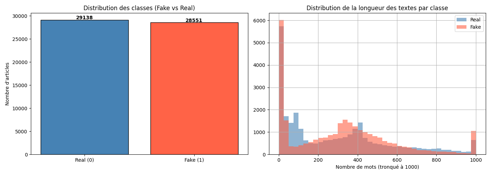

Le dataset présente une distribution **quasi-équilibrée** entre articles Fake et Real. Les articles journalistiques (Fake/Real News) sont significativement plus longs que les déclarations politiques (LIAR).

---

## 🧹 Prétraitement du Texte

### Avant vs Après Nettoyage

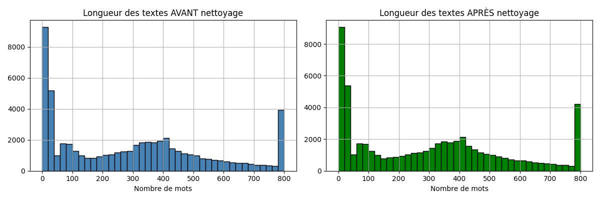

**Étapes de nettoyage :**
1. Conversion en minuscules
2. Suppression des URLs (`http://...`, `www....`)
3. Suppression des balises HTML
4. Suppression du mot "reuters" (biais source)
5. Suppression de la ponctuation
6. Normalisation des espaces

---

## 🤖 Machine Learning Classique

### Évolution de l'Accuracy selon Top-K

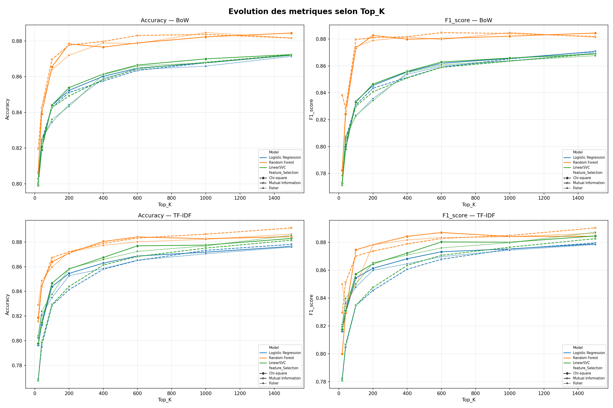

> **Observation :** L'accuracy augmente régulièrement avec Top-K, avec un gain marginal qui diminue après K=600. Le passage de K=20 à K=1500 représente un gain de ~7% d'accuracy.

### Distribution de l'Accuracy par Modèle

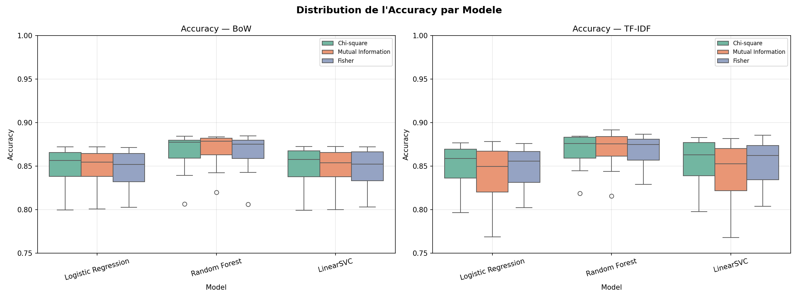

### Heatmap Accuracy (Modèle × Feature Selection)

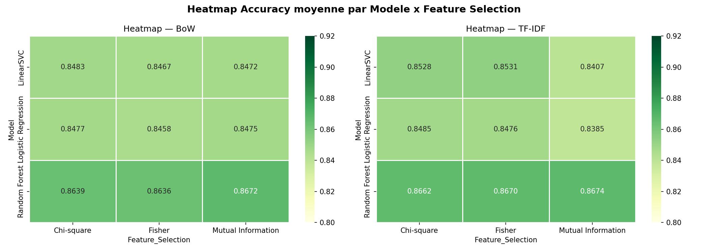

> **Meilleure combinaison :** `Mutual Information` × `Random Forest` avec TF-IDF

### Évolution du ROC-AUC selon Top-K

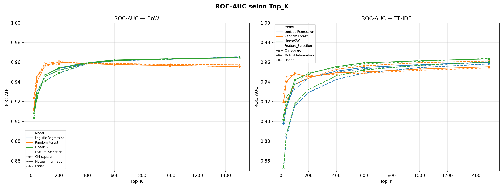

### Top 15 Meilleures Combinaisons ML

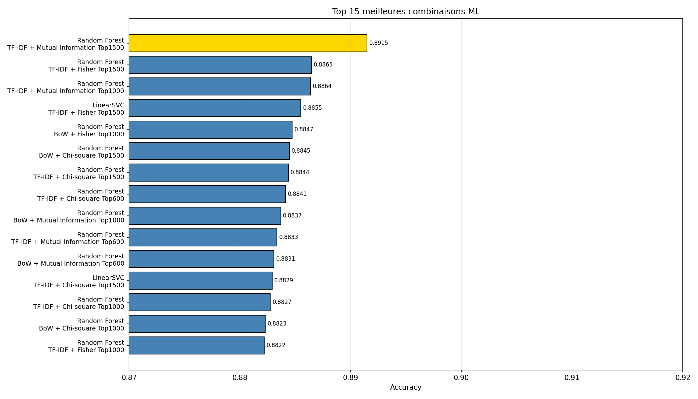

### Comparaison Globale des Modèles ML

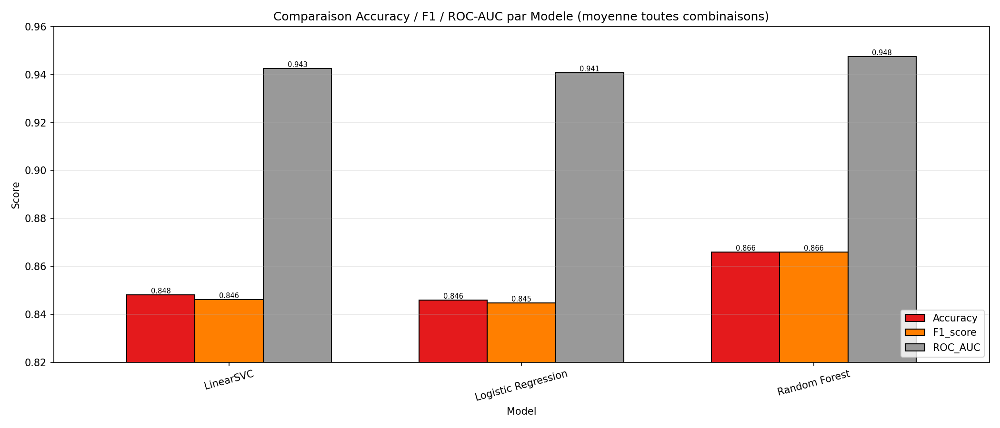

### Temps d'Entraînement par Modèle

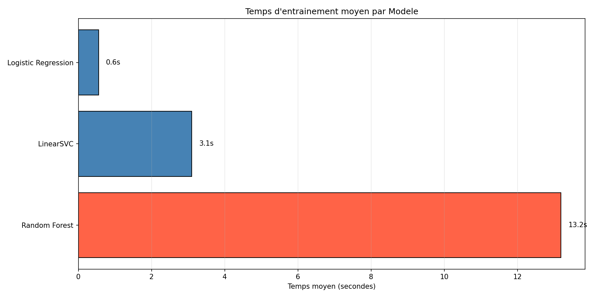

> **Note technique :** Le SVM classique (`SVC`) était prohibitif en temps sur 57k articles (complexité O(N²)). Nous utilisons **LinearSVC** (complexité O(N)), enveloppé dans `CalibratedClassifierCV` pour obtenir de vraies probabilités et calculer le Log-Loss.

---

## 🧠 Deep Learning — LSTM

### Architecture BiLSTM Corrigée

```python
class ImprovedLSTM(nn.Module):
    Embedding(vocab_size=10000, dim=128)
    → Dropout(0.4)                    # Anti-overfitting
    → BiLSTM(hidden=64, dropout=0.3)  # Bidirectionnel
    → Global Average Pooling          # Évite le biais padding
    → Linear(128 → 1)
    → Sigmoid()
```

**Corrections appliquées :**
- ✅ **Global Average Pooling** au lieu de prendre le dernier état (qui pouvait être du padding)
- ✅ **Dropout(0.4)** sur les embeddings + `dropout=0.3` dans le LSTM
- ✅ **Early Stopping** (patience=3) pour éviter l'overfitting

### Courbes d'Apprentissage LSTM

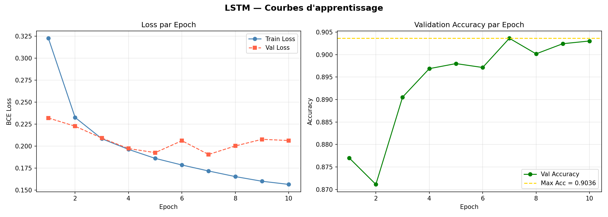

### Matrice de Confusion LSTM

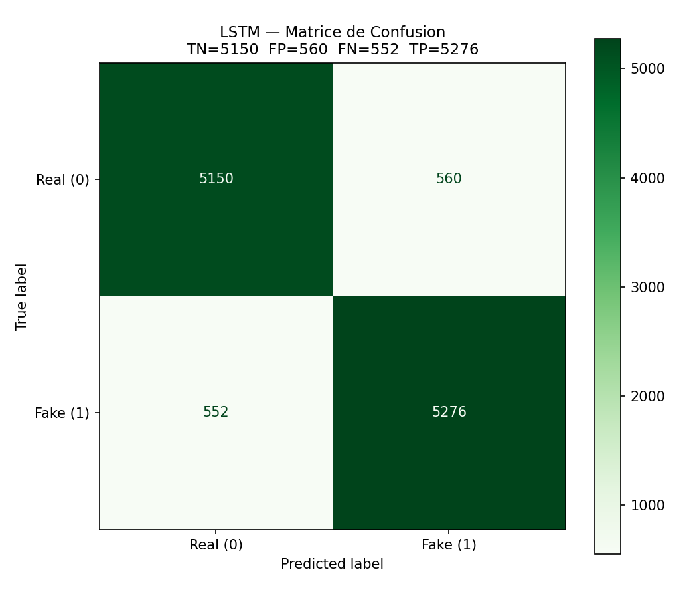

### Courbe ROC & Distribution des Probabilités LSTM

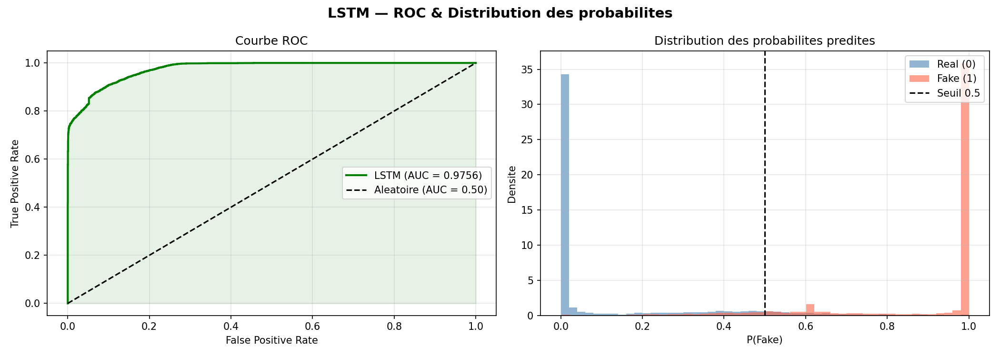

### Métriques Finales LSTM

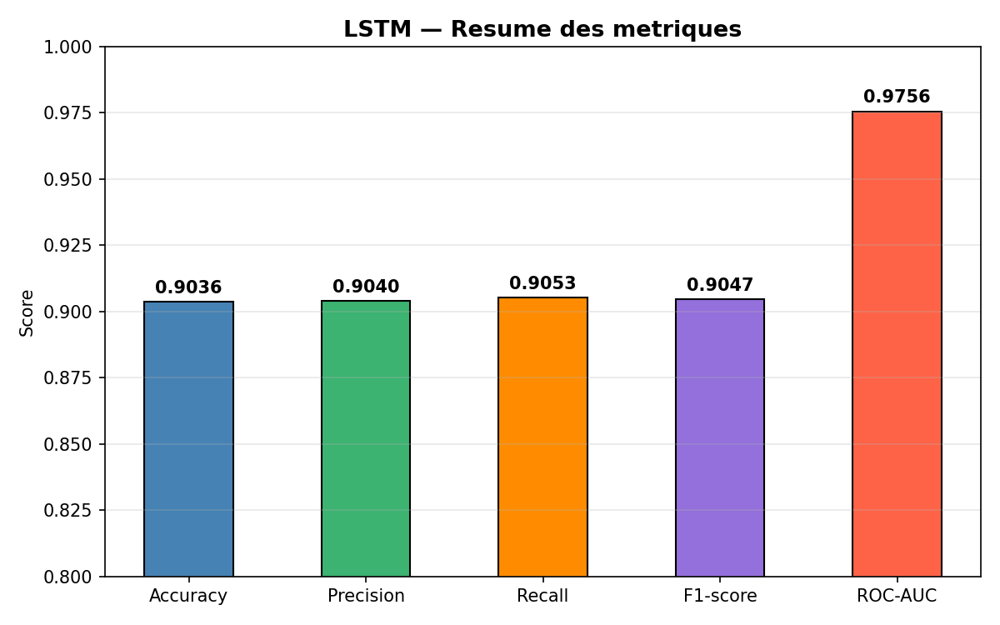

---

## 🤗 Deep Learning — DistilBERT Fine-Tuned

### Pourquoi DistilBERT ?

BERT complet (`bert-base-uncased`) contient **110M paramètres** et est très coûteux en ressources. **DistilBERT** est une version distillée :
- **40% plus léger** (66M paramètres)
- **60% plus rapide** à l'inférence
- **97% des performances** de BERT conservées
- Architecture Transformer complète préservée

### Configuration d'Entraînement

```
Epochs     : 3 (Early Stopping patience=2)
Batch Size : 32
LR         : 2e-5 (AdamW + weight_decay=0.01)
Max Length : 128 tokens
Gradient Clipping : 1.0
Device     : GPU T4 (Google Colab)
```

### Résultats par Epoch

| Epoch | Train Loss | Val Loss | Val Acc | Val F1 | Statut |
|-------|-----------|----------|---------|--------|--------|
| 1 | 0.1837 | 0.1717 | 90.85% | 0.9040 | Sauvegardé |
| 2 | 0.1452 | **0.1604** | **91.47%** | **0.9132** | ✅ Meilleur |
| 3 | 0.1074 | 0.2092 ↑ | 91.43% | 0.9132 | Early Stop |

### Courbes d'Apprentissage DistilBERT


### Matrice de Confusion DistilBERT

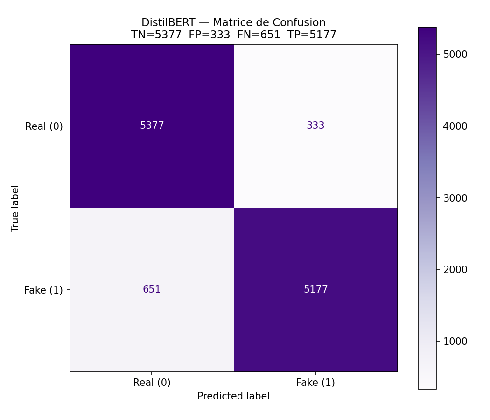

### Courbe ROC & Distribution des Probabilités DistilBERT

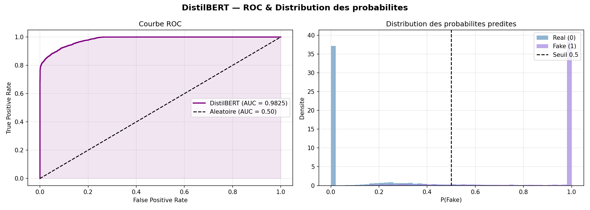

### Métriques Finales DistilBERT

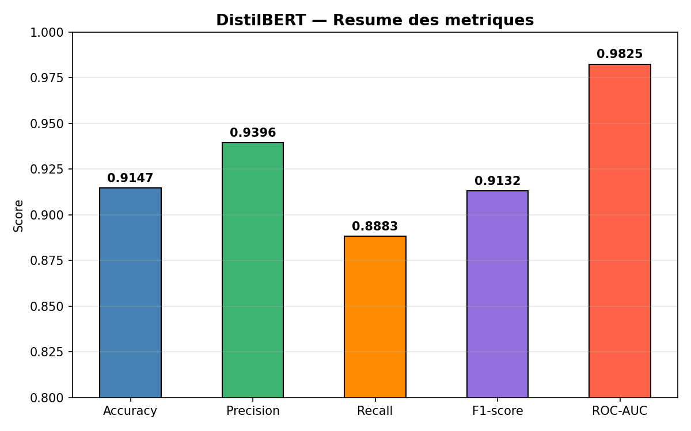

---

## ⚖️ Comparaison LSTM vs DistilBERT

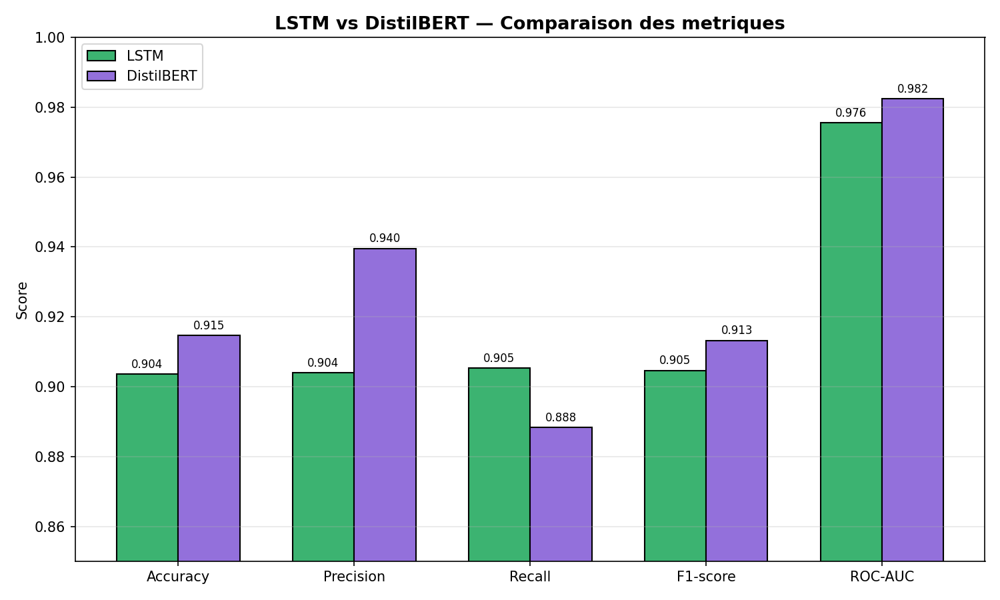

---

## ⏱️ Comparaison Finale : Temps vs Accuracy

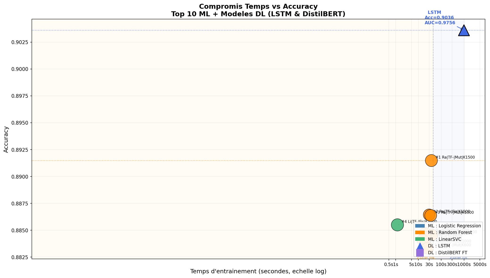

Ce graphique illustre parfaitement le **compromis Temps / Performance** :
- Les modèles **ML** (gauche) sont très rapides (< 40s) avec une accuracy entre 88-89%
- Le modèle **LSTM** (~19min) atteint 89.47%
- Le modèle **DistilBERT** (~28min) atteint **91.47%** mais nécessite un GPU

---

## 📈 Résultats Globaux

### Meilleurs Résultats par Catégorie

| Modèle | Représentation | Feature Selection | Top-K | Accuracy | F1 | AUC | Log-Loss | Temps |
|--------|---------------|-------------------|-------|---------|-----|-----|---------|-------|
| **Random Forest** | TF-IDF | Mutual Information | 1500 | **89.15%** | 0.8904 | 0.9613 | 0.2739 | 29s |
| **Logistic Regression** | BoW | Fisher | 1500 | 87.13% | 0.8697 | 0.9655 | 0.2230 | 3s |
| **LinearSVC** | TF-IDF | Fisher | 1500 | 88.53% | 0.8869 | 0.9639 | — | 0.78s |
| **LSTM** | Word Embeddings | — | — | 89.47% | 0.8975 | 0.9724 | 0.2645 | 1148s |
| **DistilBERT FT** | Transformers | — | — | **91.47%** | **0.9132** | **0.9825** | **0.1604** | 1687s |

### Matrices de Confusion Comparées

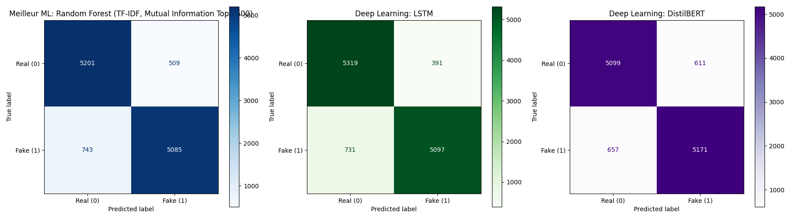

### Courbes ROC — Modèles DL

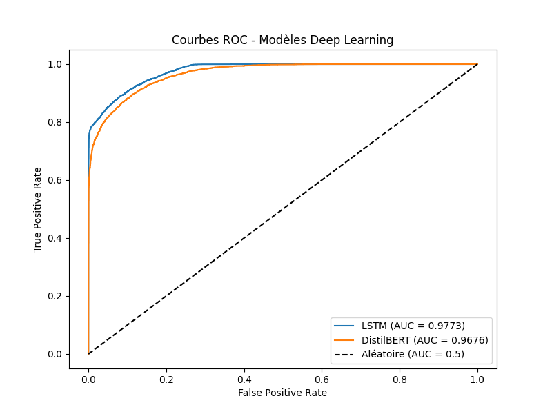

### Conclusions

| Critère | Gagnant | Valeur |
|---------|---------|--------|
| Meilleure Accuracy | DistilBERT FT | **91.47%** |
| Meilleur AUC | DistilBERT FT | **0.9825** |
| Meilleur ML | RF + TF-IDF + MI + K=1500 | 89.15% |
| Plus rapide | LinearSVC | **< 1s** |
| Meilleure FS | Mutual Information | avg 87.5% |
| Meilleur Top-K | 1500 | avg 88.2% |

---

## ⚙️ Installation

```bash
# Cloner le dépôt
git clone https://github.com/OmarElkhali/Fake-News-Detection.git
cd Fake-News-Detection

# Installer les dépendances
pip install -r requirements.txt
```

### requirements.txt
```
pandas
numpy
scikit-learn
torch
transformers
matplotlib
seaborn
tqdm
nbformat
```

### Données requises (non incluses dans le repo)

Télécharger et placer dans le dossier `data/` :
- `data/fake_real/Fake.csv` → [Kaggle Fake News](https://www.kaggle.com/clmentbisaillon/fake-and-real-news-dataset)
- `data/fake_real/True.csv` → [Kaggle Real News](https://www.kaggle.com/clmentbisaillon/fake-and-real-news-dataset)

> Les fichiers `data/liar/*.tsv` sont déjà inclus dans le repo.

### Exécution sur Google Colab (recommandé)

```python
# 1. Monter Google Drive
from google.colab import drive
drive.mount('/content/drive')

# 2. Activer le GPU : Runtime → Change runtime type → T4 GPU

# 3. Ouvrir FakeNews_Pipeline_Complete.ipynb et exécuter toutes les cellules
```

---

## 📁 Structure du Projet

```
Fake-News-Detection/
│
├── FakeNews_Pipeline_Complete.ipynb  # Notebook principal
├── requirements.txt                  # Dépendances Python
├── .gitignore
├── README.md
│
├── data/
│   ├── fake_real/                    # ⚠️ Non inclus (trop lourd)
│   │   ├── Fake.csv                  # 23 481 articles
│   │   └── True.csv                  # 21 417 articles
│   └── liar/                         # ✅ Inclus
│       ├── train.tsv
│       ├── valid.tsv
│       └── test.tsv
│
└── results/
    ├── perfs_modeles_complete.csv    # Tous les résultats (144 combos ML + DL)
    ├── y_pred_bert.npy               # Prédictions DistilBERT
    ├── y_prob_bert.npy               # Probabilités DistilBERT
    ├── y_test.npy                    # Labels de test
    └── graphes/                      # 18 figures générées
        ├── data_distribution.png
        ├── text_length_distribution.png
        ├── metrics_topk_grid.png
        ├── rocauc_topk.png
        ├── boxplot_accuracy_model.png
        ├── heatmap_accuracy.png
        ├── comparison_models_all_metrics.png
        ├── training_time_model.png
        ├── top15_combinations.png
        ├── lstm_learning_curves.png
        ├── lstm_confusion_matrix.png
        ├── lstm_roc_probdist.png
        ├── lstm_metrics_summary.png
        ├── bert_ft_learning_curves.png
        ├── bert_confusion_matrix.png
        ├── bert_roc_probdist.png
        ├── bert_metrics_summary.png
        ├── lstm_vs_bert_comparison.png
        ├── confusion_matrices.png
        ├── roc_dl_models.png
        └── 2d_time_vs_accuracy.png
```

---

## ⚠️ Limitations

1. **Biais de domaine** : La fusion de deux datasets très différents (articles longs vs déclarations courtes) peut créer un biais de style qui aide les modèles à distinguer les sources plutôt que la véracité.

2. **Langue unique** : Les modèles sont entraînés uniquement sur des données en **anglais**.

3. **Embeddings LSTM non pré-entraînés** : Le LSTM utilise des embeddings aléatoires. L'utilisation de GloVe ou FastText pourrait améliorer les performances.

4. **Contexte ignoré** : Les modèles ML (BoW/TF-IDF) ignorent complètement l'ordre des mots et le contexte sémantique.

5. **Données temporelles** : Aucune prise en compte de l'évolution temporelle des fake news (un article vrai peut devenir faux avec le temps).

6. **Limite du fine-tuning** : DistilBERT a été entraîné seulement 3 epochs par contrainte de temps GPU. Plus d'epochs avec un scheduler de LR optimisé pourrait atteindre 93-95%.

---

## 👤 Auteur

**Omar El Khali**
- GitHub : [@OmarElkhali](https://github.com/OmarElkhali)
- Projet : Mini-projet NLP — Détection de Fake News

---

## 📄 Licence

Ce projet est open-source sous licence MIT.
